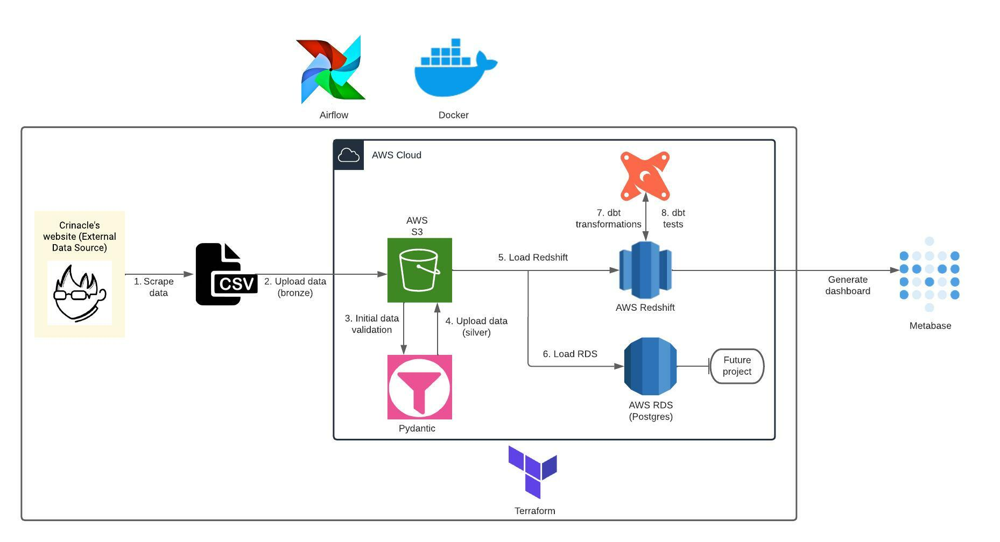

# Audiophile End-To-End ELT Pipeline

## URL
https://github.com/ris-tlp/audiophile-e2e-pipeline

## Schema
(Picture is downloaded from the Audiophile ELT repository)

The repository is for an end-to-end Extract, Load, Transform (ELT) pipeline called "Audiophile." This pipeline is designed to extract data from Crinacle's Headphone and InEarMonitor databases and finalize the data for a Metabase Dashboard.

Here's a detailed description of the architecture, components, and interactions:

**Architecture:**

The architecture of this solution is based on several technologies:

- **Terraform:** This is used for infrastructure provisioning. Terraform is an open-source infrastructure as code software tool that provides a consistent CLI workflow for managing cloud service. It allows infrastructure to be expressed as code in a simple, human-readable language, and it enables developers to use consistent tooling to deliver and manage their applications.

- **Docker:** The solution is containerized through Docker. Docker is a set of platform as a service (PaaS) products that use OS-level virtualization to deliver software in packages called containers. Containers are isolated from each other and bundle their own software, libraries and configuration files; they can communicate with each other through well-defined channels.

- **Airflow:** The pipeline is orchestrated through Airflow. Apache Airflow is an open-source platform to programmatically author, schedule and monitor workflows.

- **Metabase:** The data is finalized for a Metabase Dashboard. Metabase is an open source business intelligence tool. It lets you ask questions about your data and displays answers in formats that make sense, whether that's a bar graph or a detailed table.

**Components and Interactions:**

The pipeline consists of several tasks, which are executed in a sequence:

1. **Scrape data:** The first task is to scrape data from Crinacle's website to generate bronze data. Bronze data is raw data that has been extracted but not yet processed.

2. **Load to AWS S3:** The bronze data is then loaded to AWS S3. Amazon S3 (Simple Storage Service) is an object storage service that offers industry-leading scalability, data availability, security, and performance.

3. **Data parsing and validation:** The bronze data undergoes initial data parsing and validation through Pydantic to generate silver data. Silver data is a cleaned, validated version of the bronze data.

4. **Load to AWS S3:** The silver data is then loaded to AWS S3.

5. **Load to AWS Redshift:** The silver data is also loaded to AWS Redshift. Amazon Redshift is a fully managed, petabyte-scale data warehouse service in the cloud.

6. **Load to AWS RDS:** The silver data is loaded to AWS RDS for future projects. Amazon RDS (Relational Database Service) makes it easy to set up, operate, and scale a relational database in the cloud.

7. **Transform and test data:** The data is transformed and tested through dbt in the warehouse. dbt (data build tool) enables data analysts and engineers to transform their data using the same practices that software engineers use to build applications.

**Pros and Cons:**

**Pros:**

- **Scalability:** The use of AWS services provides scalability and reliability.

- **Automation:** The use of Airflow for orchestration allows for automated scheduling and monitoring of workflows.

- **Containerization:** Docker provides an efficient, lightweight approach to application deployment, because each application and its dependencies can be bundled together as a Docker image that can be run anywhere Docker is installed.

**Cons:**

- **Complexity:** The pipeline involves several different technologies and services, which can make it complex to set up and manage.

- **Cost:** The use of multiple AWS services can lead to high costs, especially for large amounts of data.

- **Dependency on specific technologies:** The pipeline is dependent on specific technologies (e.g

., Terraform, Docker, Airflow, AWS), which might not be ideal for all use cases or environments.

To run the pipeline, you need to configure your AWS account through AWS CLI, install Terraform and Docker, and then follow the provided commands to create AWS services, generate configuration, build Docker images, and run the pipeline.

Please note that this analysis is based on the information available in the repository. For a more detailed understanding, it would be beneficial to review the codebase and any additional documentation provided by the repository owner.