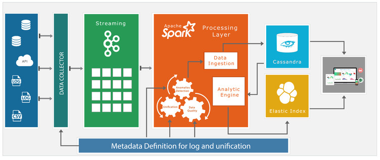

# BDB - Unified integrated Data Analytics Platform
* https://bdb.ai/
* https://www.linkedin.com/pulse/big-data-pipeline-implementation-use-case-avin-jain/

## Schema
(Downloaded from LinkedIn article)

## Architecture
- **Data Ingestion**: The platform can handle a large set of streaming data. The data streams through a Kafka layer and are moved into a Data Lake (in HBase, Hadoop, Cassandra, Azure, or AWS) as Transient Data.

- **Data Transformation**: The data is passed through a Data Transformation layer and saved into the Raw Zone of the Data Lake.

- **Data Unification**: The faulty data can be treated in the Data Unification layers, and the cleaned data after the Compute Zones can be pushed into the Trusted Zone of the Data Lake.

- **Compute Layers**: The Compute Layers have a Predictive Tool that has integration with R, Scala Custom Code, Shell Scripts, and integration with Spark ML.

- **Data Extraction**: The Trusted data from the Data Lake can be extracted, transformed, and loaded into Elastic Cube and Cassandra for visualization.

- **Visualization**: The data is visualized in the form of Reports, Self Service BI, Dashboards, Infographic based Advanced Analytics Dashboards.

- **Scalability and Benefits**: The BDB system works in one platform/integrated ecosystem on Cloud rather than working in SILOS like other vendors. It provides real-time attendance & assessment reporting to its entire 40 million active user base – Teachers, Students, Administrators, etc. It also leads to a substantial reduction in the cost of operation and saves time and effort to create an analytics platform.

The architecture is designed to utilize IoT, ML, AI, BigData, and traditional data in a seamless manner. It has been implemented (at Beta Level) for an enterprise customer with 50 million active users and is now being applied to Banking and Financial Sector, Agri Data Science, WorkForce, and Health Care Case studies.