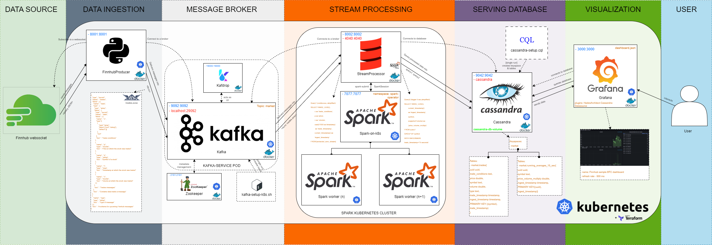

# Finnhub Streaming Data Pipeline

## URL
https://github.com/RSKriegs/finnhub-streaming-data-pipeline

## Schema
(Picture is downloaded from Finnhub repository)

## Overview

* *This project is a streaming data pipeline that uses real-time trading data from the Finnhub.io API/websocket.
* The pipeline is designed to showcase key aspects of streaming pipeline development and architecture, providing low latency, scalability, and availability.
* Solution was developed and tested locally in minicube, production usage would require deployment to a Kubernetes cluster.

## Breakdown of the architecture of this streaming data pipeline:

1. **Data Ingestion Layer**:
* A containerized Python application called `FinnhubProducer` connects to the Finnhub.io websocket.
* It encodes retrieved messages into Avro format as specified in the `schemas/trades.avsc` file and ingests messages into a Kafka broker.

2. **Message Broker Layer**:
* Messages from `FinnhubProducer` are consumed by a Kafka broker, which is located in the `kafka-service` pod and has Kafdrop service as a sidecar ambassador container for Kafka.
* The Zookeeper pod is launched before Kafka as it is required for its metadata management.
* Repository contains Dockerfile for building Kafka image with setup bash script, which creates Kafka topic.

1. **Stream Processing Layer**: A Spark Kubernetes cluster based on `spark-k8s-operator` is deployed using Helm. A Scala application called `StreamProcessor` is submitted into Spark cluster manager, that delegates a worker for it. This application connects to Kafka broker to retrieve messages, transform them using Spark Structured Streaming, and loads into Cassandra tables.

2. **Serving Database Layer**: A Cassandra database stores and persists data from Spark jobs. Upon launching, the `cassandra-setup.cql` script runs to create keyspace and tables.

3. **Visualization Layer**: Grafana connects to Cassandra database using `HadesArchitect-Cassandra-Plugin` and serves visualized data to users as in the example of `Finnhub Sample BTC Dashboard`.

The entire pipeline is containerized into Docker containers, which are orchestrated by Kubernetes, and its infrastructure is managed by Terraform.

**Pros of this solution**:

- The use of Docker and Kubernetes allows for efficient orchestration of the pipeline.
- The use of Spark for stream processing allows for real-time data processing.
- The use of Kafka as a message broker provides a scalable and reliable solution for data ingestion.
- The use of Cassandra for data storage provides a scalable and reliable solution for data persistence.

**Cons of this solution**:

- The pipeline is more complex than necessary for the task at hand, which could lead to unnecessary complications.
- The pipeline may incur costs if not managed properly, particularly if large amounts of data are processed or if the infrastructure is kept running for extended periods.
- The pipeline is dependent on specific technologies (Kubernetes, Spark, Kafka, Cassandra), which might limit flexibility.
- The pipeline lacks a comprehensive CI/CD setup, which could make deployment and updates more difficult.