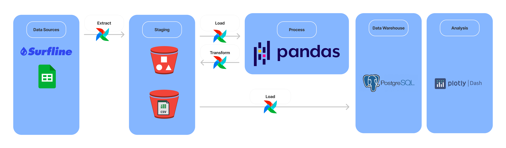

# Surfline Dashboard

## URL
https://github.com/andrem8/surf_dash

## Schema
(Downloaded from Surfline repository)

## Overview

* Project is designed to collect data from the Surfline API, export it to an AWS S3 bucket, and then ingest it into a Postgres data warehouse for visualization and analysis.
* The project uses Airflow for orchestration, and the data dashboard is run locally with Plotly.

### Summary of the project's architecture and components:

**Architecture:**

- **Data Collection:** The pipeline collects data from the Surfline API.

- **Data Storage:** The collected data is exported as a CSV file to an AWS S3 bucket.

- **Data Ingestion:** The most recent file in the S3 bucket is downloaded and ingested into a Postgres data warehouse. A temporary table is created, and then the unique rows are inserted into the data tables.

- **Orchestration:** Airflow is used for orchestration and is hosted locally with Docker Compose and MySQL.

- **Data Warehouse:** Postgres is used as the data warehouse and is also running locally in a Docker container.

- **Data Dashboard:** The data dashboard is run locally with Plotly, a Python graphing library.

The repository also includes a list of learning resources for various technologies used in the project, including Airflow, AWS S3, Docker, and Plotly.

Please note that this summary is based on the information available in the repository. For a more detailed understanding, it would be beneficial to review the codebase and any additional documentation provided by the repository owner.