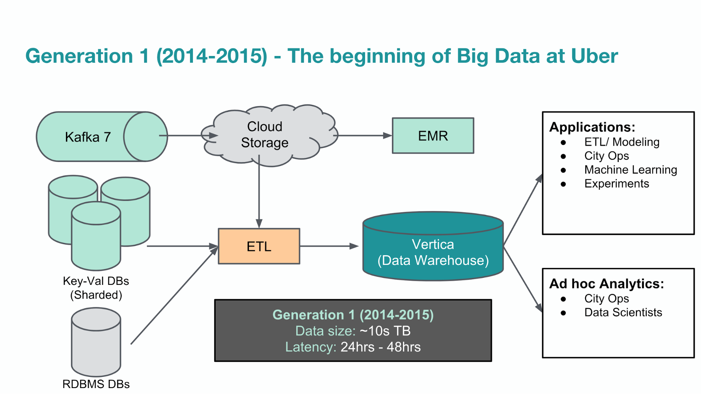
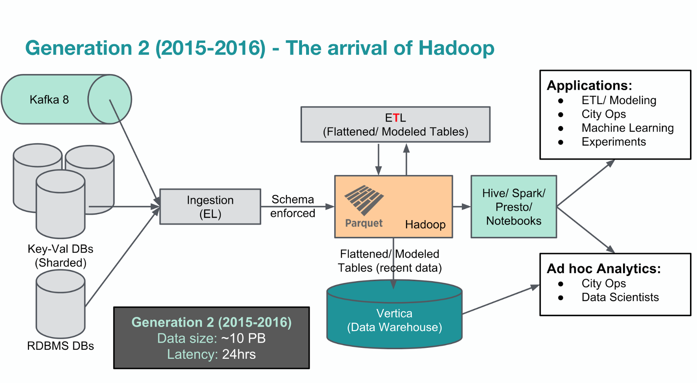
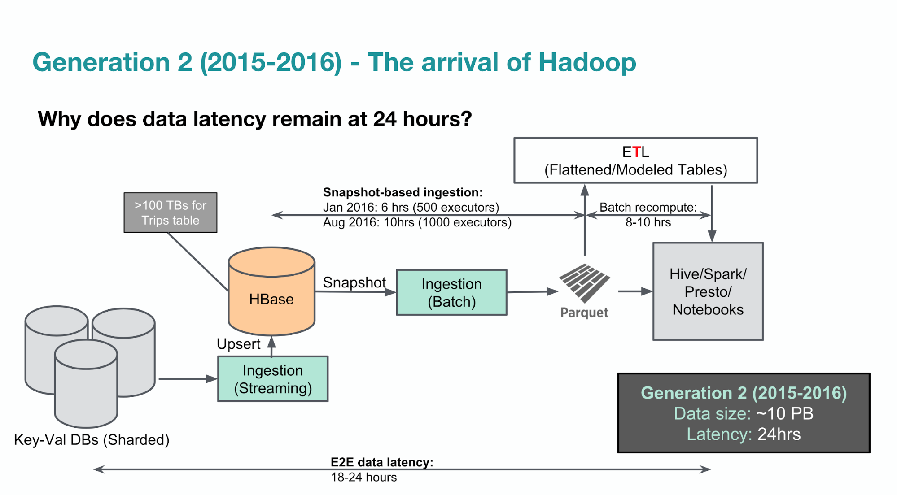
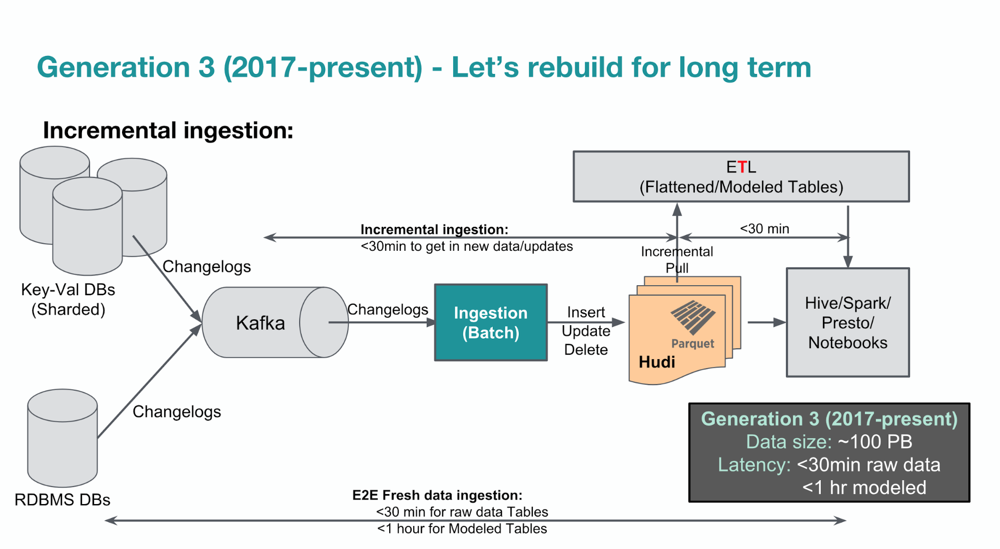
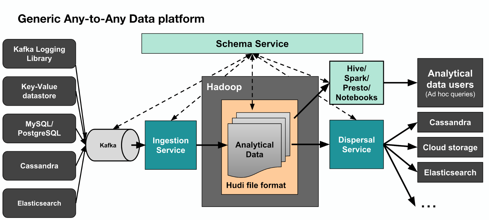

# Uber data platform

## URL
https://www.uber.com/en-DE/blog/uber-big-data-platform/

## Overview
* Uber's data pipeline has evolved over the years as the scale of their operations has increased.
* As of 2018, Uber had over 100 petabytes of analytical data that needs to be processed and served with minimum latency through their Apache Hadoop® based Big Data platform.
(Pictures are downloaded from the original article.)

### First Generation

 

Sure, here are the key points about the first generation of Uber's data pipeline:

- Before 2014, Uber's data could fit into a few traditional online transaction processing (OLTP) databases, specifically MySQL and PostgreSQL.
- Engineers had to access each database or table individually, and there was no global access or view of all stored data.
- The data was scattered across different OLTP databases, and the total data size was on the order of a few terabytes.
- As Uber's business grew, the amount of incoming data increased, necessitating the construction of the first generation of their analytical data warehouse.
- The goal of this warehouse was to make all analytical data accessible to analysts in one place.
- Uber categorized their data users into three main categories: city operations teams, data scientists and analysts, and engineering teams.
- They used Vertica as their data warehouse software due to its fast, scalable, and column-oriented design.
- They developed multiple ad hoc ETL (Extract, Transform, and Load) jobs that copied data from different sources into Vertica.
- To streamline data access, they standardized SQL as their solution's interface and built an online query service to accept user queries and submit them to the underlying query engine.
- This first generation data warehousing service was a huge success, providing users with a global view and access to all data in one place.
- However, this system had its limitations, such as data reliability concerns due to ad hoc ETL jobs and a lack of a formal schema communication mechanism.
- Scaling the data warehouse also became increasingly expensive, leading to the deletion of older, obsolete data to free up space for new data.

### Second Generation

 

 

- To address the limitations of the first generation, Uber re-architected their Big Data platform around the Hadoop ecosystem.
- They introduced a Hadoop data lake where all raw data was ingested from different online data stores only once and with no transformation during ingestion.
- They introduced [Presto](presto.md) for interactive ad hoc user queries, Apache Spark for programmatic access to raw data, and Apache Hive for extremely large queries.
- All data modeling and transformation only happened in Hadoop, enabling fast backfilling and recovery when issues arose.
- Only the most critical modeled tables were transferred to their data warehouse, significantly lowering the operational cost of running a huge data warehouse.
- They leveraged the standard columnar file format of Apache Parquet, resulting in storage savings and compute resource gains.
- All data services in this ecosystem were made horizontally scalable, improving the efficiency and stability of their Big Data platform.
- They transitioned from JSON to Parquet to store schema and data together, building a central schema service to collect, store, and serve schemas.
- Fragile, ad hoc data ingestions jobs were replaced with a standard platform to transfer all source data in its original, nested format into the Hadoop data lake.
- With Uber’s business continuing to scale, they soon had tens of petabytes of data, with tens of terabytes of new data added to their data lake daily.
- However, they faced new challenges such as the massive amount of small files stored in their HDFS and data latency that was still far from what their business needed.
- The snapshot-based ingestion method was inefficient and prevented them from ingesting data with lower latency.
- ETL jobs that ingested data into the data warehouse were also very fragile due to the lack of a formal contract between the services producing the data and the downstream data consumers.
- The same data could be ingested multiple times if different users performed different transformations during ingestion, resulting in extra pressure on their upstream data sources and increased storage costs.
- Backfilling was very time-and-labor-consuming because the ETL jobs were ad hoc and source-dependent, and data projections and transformation were performed during ingestion.
- It was also difficult to ingest any new data sets and types due to the lack of standardization in their ingestion jobs.

### Third Generation

 

 

- By early 2017, Uber's Big Data platform was used by engineering and operations teams across the company, enabling them to access new and historical data all in one place.
- With over 100 petabytes of data in HDFS, 100,000 vcores in their compute cluster, 100,000 Presto queries per day, 10,000 Spark jobs per day, and 20,000 Hive queries per day, their Hadoop analytics architecture was hitting scalability limitations and many services were affected by high data latency.
- To address these limitations, they built Hadoop Upserts anD Incremental (Hudi), an open source Spark library that provides an abstraction layer on top of HDFS and Parquet to support the required update and delete operations.
- Hudi enables them to update, insert, and delete existing Parquet data in Hadoop. Moreover, Hudi allows data users to incrementally pull out only changed data, significantly improving query efficiency and allowing for incremental updates of derived modeled tables.
- They also formalized the hand-over of upstream datastore changes between the storage and big data teams through Apache Kafka. Upstream datastore events stream into Kafka with a unified Avro encoding including standard global metadata headers attached.
- Their data ingestion platform, Marmaray, runs in mini-batches and picks up the upstream storage changelogs from Kafka, applying them on top of the existing data in Hadoop using Hudi library.
- Using the Hudi library, they were able to move away from the snapshot-based ingestion of raw data to an incremental ingestion model that enables them to reduce data latency from 24 hours to less than one hour.
- They built a generic ingestion platform that facilitates the ingestion of raw data into Hadoop in a unified and configurable way. Now, their Big Data platform updates raw Hadoop tables incrementally with a data latency of 10-15 minutes, allowing for fast access to source data.
- The use of a Hudi writer during an ETL job enables them to update old partitions in the derived modeled tables without recreating the entire partition or table. Thus, their modeling ETL jobs use Hudi readers to incrementally fetch only the changed data from the source table and use Hudi writers to incrementally update the derived output table. Now, ETL jobs also finish in less than 30 minutes, providing end-to-end latency of less than one hour for all derived tables in Hadoop.